# API - GET: Listar Vehículos

## 📘 Operación de Lectura (Read All)

Este documento explica en detalle la implementación del endpoint para **listar todos los vehículos** en el API REST.

---

## 🎯 Objetivo

Obtener una lista completa de todos los vehículos registrados en la base de datos.

**Endpoint**: `GET /api/Vehiculo`

**Response**: Array de `VehiculoResponse` (datos básicos para listado)

---

## 🔄 Flujo Completo de la Request

```mermaid
sequenceDiagram
    participant Client as Cliente<br/>(React/Razor/Postman)
    participant API as VehiculoController
    participant Flujo as VehiculoFlujo
    participant DA as VehiculoDA
    participant Repo as RepositorioDapper
    participant SP as Stored Procedure
    participant DB as SQL Server
    
    Client->>API: GET /api/Vehiculo
    Note over API: [HttpGet]
    
    API->>API: OnActionExecuting()<br/>(Model Binding)
    
    API->>Flujo: Obtener()
    Note over Flujo: Business Logic Layer
    
    Flujo->>DA: Obtener()
    Note over DA: Data Access Layer
    
    DA->>Repo: ObtenerRepositorio()
    Repo-->>DA: SqlConnection
    
    DA->>SP: ExecuteAsync("ObtenerVehiculos")
    Note over SP: Dapper QueryAsync
    
    SP->>DB: SELECT v.*, m.Nombre as Marca,<br/>mo.Nombre as Modelo<br/>FROM Vehiculo v<br/>JOIN Modelo mo ON v.IdModelo = mo.Id<br/>JOIN Marca m ON mo.IdMarca = m.Id
    
    DB-->>SP: ResultSet (Rows)
    SP-->>DA: IEnumerable<VehiculoResponse>
    
    DA-->>Flujo: IEnumerable<VehiculoResponse>
    Flujo-->>API: IEnumerable<VehiculoResponse>
    
    API->>API: Validar resultado
    
    alt Tiene vehículos
        API-->>Client: 200 OK<br/>Content-Type: application/json<br/>Body: VehiculoResponse[]
    else Lista vacía
        API-->>Client: 204 No Content
    end
```



---

## 💻 Implementación Backend

### 1. Controller (API Layer)

```csharp
// API/Controllers/VehiculoController.cs
[Route("api/[controller]")]
[ApiController]
public class VehiculoController : ControllerBase, IVehiculoController
{
    private readonly IVehiculoFlujo _vehiculoFlujo;
    private readonly ILogger<VehiculoController> _logger;

    public VehiculoController(
        IVehiculoFlujo vehiculoFlujo, 
        ILogger<VehiculoController> logger)
    {
        _vehiculoFlujo = vehiculoFlujo;
        _logger = logger;
    }

    /// <summary>
    /// Obtiene la lista de todos los vehículos registrados.
    /// </summary>
    /// <returns>Lista de vehículos</returns>
    /// <response code="200">Retorna la lista de vehículos</response>
    /// <response code="204">No hay vehículos registrados</response>
    [HttpGet]
    [ProducesResponseType(typeof(IEnumerable<VehiculoResponse>), StatusCodes.Status200OK)]
    [ProducesResponseType(StatusCodes.Status204NoContent)]
    public async Task<IActionResult> Obtener()
    {
        try
        {
            _logger.LogInformation("Obteniendo lista de vehículos");
            
            // 1. Llamar a la capa de negocio
            var resultado = await _vehiculoFlujo.Obtener();
            
            // 2. Validar si hay resultados
            if (resultado == null || !resultado.Any())
            {
                _logger.LogInformation("No se encontraron vehículos");
                return NoContent(); // 204
            }
            
            // 3. Retornar lista con 200 OK
            _logger.LogInformation($"Se encontraron {resultado.Count()} vehículos");
            return Ok(resultado); // 200 + JSON
        }
        catch (Exception ex)
        {
            _logger.LogError(ex, "Error al obtener vehículos");
            return StatusCode(500, new { mensaje = "Error interno del servidor" });
        }
    }
}
```

**Principios aplicados**:
- ✅ **SRP**: Controller solo maneja HTTP, delega lógica a Flujo
- ✅ **DIP**: Depende de `IVehiculoFlujo`, no de implementación concreta
- ✅ **OCP**: Extensible sin modificar (agregar cache, filtros, etc.)

---

### 2. Flujo (Business Logic Layer)

```csharp
// Flujo/VehiculoFlujo.cs
public class VehiculoFlujo : IVehiculoFlujo
{
    private readonly IVehiculoDA _vehiculoDA;
    private readonly IRevisionReglas _revisionReglas;
    private readonly IRegistroReglas _registroReglas;

    public VehiculoFlujo(
        IVehiculoDA vehiculoDA, 
        IRevisionReglas revisionReglas, 
        IRegistroReglas registroReglas)
    {
        _vehiculoDA = vehiculoDA;
        _revisionReglas = revisionReglas;
        _registroReglas = registroReglas;
    }

    /// <summary>
    /// Obtiene todos los vehículos (sin enriquecer con validaciones externas).
    /// </summary>
    /// <returns>Lista básica de vehículos</returns>
    public async Task<IEnumerable<VehiculoResponse>> Obtener()
    {
        // Para listados, solo retornamos datos básicos
        // Las validaciones externas se hacen solo en GetById
        return await _vehiculoDA.Obtener();
    }
}
```

**Decisión de diseño**:
- ❌ **No aplicamos reglas** en listados (performance)
- ✅ **Solo datos básicos** (VehiculoResponse)
- ✅ **Reglas solo en detalle** (VehiculoDetalle)

**Razón**: Validaciones externas (API calls) son costosas. Para listar 100 vehículos serían 200 requests adicionales. Solo validamos cuando el usuario ve el detalle de uno específico.

---

### 3. Data Access Layer

```csharp
// DA/VehiculoDA.cs
public class VehiculoDA : IVehiculoDA
{
    private readonly IRepositorioDapper _repositorioDapper;
    private readonly SqlConnection _sqlConnection;

    public VehiculoDA(IRepositorioDapper repositorioDapper)
    {
        _repositorioDapper = repositorioDapper;
        _sqlConnection = _repositorioDapper.ObtenerRepositorio();
    }

    /// <summary>
    /// Obtiene todos los vehículos desde la base de datos.
    /// </summary>
    /// <returns>Lista de vehículos con marca y modelo</returns>
    public async Task<IEnumerable<VehiculoResponse>> Obtener()
    {
        string query = @"ObtenerVehiculos"; // Nombre del Stored Procedure
        
        try
        {
            // Ejecutar SP con Dapper
            var resultado = await _sqlConnection.QueryAsync<VehiculoResponse>(
                query,
                commandType: CommandType.StoredProcedure
            );
            
            return resultado;
        }
        catch (SqlException ex)
        {
            throw new Exception($"Error al obtener vehículos: {ex.Message}", ex);
        }
    }
}
```

**Dapper advantages**:
- ✅ **Performance**: Mapeo directo sin overhead de EF Core
- ✅ **Control**: SQL explícito en stored procedures
- ✅ **Simple**: Una línea ejecuta y mapea

---

### 4. Stored Procedure

```sql
-- BD/dbo/Stored Procedures/ObtenerVehiculos.sql
CREATE PROCEDURE [dbo].[ObtenerVehiculos]
AS
BEGIN
    SET NOCOUNT ON;
    
    SELECT 
        v.Id,
        v.Placa,
        v.Color,
        v.Anio,
        v.Precio,
        v.CorreoPropietario,
        v.TelefonoPropietario,
        m.Nombre AS Marca,
        mo.Nombre AS Modelo,
        v.IdModelo
    FROM 
        Vehiculo v
    INNER JOIN 
        Modelo mo ON v.IdModelo = mo.Id
    INNER JOIN 
        Marca m ON mo.IdMarca = m.Id
    ORDER BY 
        v.Placa ASC;
END
```

**Ventajas del SP**:
- ✅ **JOIN optimizado** en BD (más rápido que múltiples queries)
- ✅ **Cambios sin recompilar**: Modificar SQL sin rehacer DLL
- ✅ **Seguridad**: Permisos granulares en BD

---

## 📊 Modelo de Datos

### VehiculoResponse (DTO)

```csharp
// Abstracciones/Modelos/Vehiculo.cs

/// <summary>
/// DTO para listados de vehículos (datos básicos).
/// No incluye validaciones externas (RevisionValida, RegistroValido).
/// </summary>
public class VehiculoResponse
{
    /// <summary>Identificador único del vehículo</summary>
    public Guid Id { get; set; }
    
    /// <summary>Placa del vehículo (ABC-123)</summary>
    public string Placa { get; set; }
    
    /// <summary>Color del vehículo</summary>
    public string Color { get; set; }
    
    /// <summary>Año de fabricación</summary>
    public int Anio { get; set; }
    
    /// <summary>Precio en USD</summary>
    public decimal Precio { get; set; }
    
    /// <summary>Nombre de la marca (ej: Toyota)</summary>
    public string Marca { get; set; }
    
    /// <summary>Nombre del modelo (ej: Corolla)</summary>
    public string Modelo { get; set; }
    
    /// <summary>Email del propietario</summary>
    public string CorreoPropietario { get; set; }
    
    /// <summary>Teléfono del propietario</summary>
    public string TelefonoPropietario { get; set; }
    
    /// <summary>ID del modelo (para edición)</summary>
    public Guid IdModelo { get; set; }
}
```

**Interface Segregation Principle (ISP)**:
- `VehiculoResponse`: Solo campos necesarios para listado
- `VehiculoDetalle`: Extiende con validaciones (hereda de VehiculoResponse)
- `VehiculoRequest`: Solo campos para crear/actualizar

---

## 🔐 HTTP Response

### Caso 1: Lista con vehículos (200 OK)

```http
HTTP/1.1 200 OK
Content-Type: application/json; charset=utf-8
Content-Length: 1234

[
  {
    "id": "3fa85f64-5717-4562-b3fc-2c963f66afa6",
    "placa": "ABC-123",
    "color": "Rojo",
    "anio": 2023,
    "precio": 25000.00,
    "marca": "Toyota",
    "modelo": "Corolla",
    "correoPropietario": "juan@example.com",
    "telefonoPropietario": "555-1234",
    "idModelo": "8fa85f64-5717-4562-b3fc-2c963f66afa6"
  },
  {
    "id": "4fa85f64-5717-4562-b3fc-2c963f66afa7",
    "placa": "XYZ-789",
    "color": "Azul",
    "anio": 2024,
    "precio": 30000.00,
    "marca": "Honda",
    "modelo": "Civic",
    "correoPropietario": "maria@example.com",
    "telefonoPropietario": "555-5678",
    "idModelo": "9fa85f64-5717-4562-b3fc-2c963f66afa7"
  }
]
```

### Caso 2: Lista vacía (204 No Content)

```http
HTTP/1.1 204 No Content
Content-Length: 0
```

**Razón del 204**: Según REST, cuando no hay contenido pero la request fue exitosa, usar 204 en lugar de 200 con array vacío.

---

## 🧪 Testing

### Test Unitario (Controller)

```csharp
// API.Tests/VehiculoControllerTests.cs
public class VehiculoControllerTests
{
    private readonly Mock<IVehiculoFlujo> _mockFlujo;
    private readonly Mock<ILogger<VehiculoController>> _mockLogger;
    private readonly VehiculoController _controller;

    public VehiculoControllerTests()
    {
        _mockFlujo = new Mock<IVehiculoFlujo>();
        _mockLogger = new Mock<ILogger<VehiculoController>>();
        _controller = new VehiculoController(_mockFlujo.Object, _mockLogger.Object);
    }

    [Fact]
    public async Task Obtener_ConVehiculos_Retorna200Ok()
    {
        // Arrange
        var vehiculos = new List<VehiculoResponse>
        {
            new VehiculoResponse { Id = Guid.NewGuid(), Placa = "ABC-123" },
            new VehiculoResponse { Id = Guid.NewGuid(), Placa = "XYZ-789" }
        };
        _mockFlujo.Setup(f => f.Obtener()).ReturnsAsync(vehiculos);

        // Act
        var result = await _controller.Obtener();

        // Assert
        var okResult = Assert.IsType<OkObjectResult>(result);
        Assert.Equal(200, okResult.StatusCode);
        var data = Assert.IsAssignableFrom<IEnumerable<VehiculoResponse>>(okResult.Value);
        Assert.Equal(2, data.Count());
    }

    [Fact]
    public async Task Obtener_SinVehiculos_Retorna204NoContent()
    {
        // Arrange
        _mockFlujo.Setup(f => f.Obtener()).ReturnsAsync(new List<VehiculoResponse>());

        // Act
        var result = await _controller.Obtener();

        // Assert
        var noContentResult = Assert.IsType<NoContentResult>(result);
        Assert.Equal(204, noContentResult.StatusCode);
    }
}
```

---

## 📈 Performance Considerations

### Optimizaciones Aplicadas

1. **Sin validaciones externas**: En listados se omiten para evitar N+1 API calls
2. **JOIN en BD**: Más rápido que múltiples queries
3. **Stored Procedure**: Plan de ejecución cacheado por SQL Server
4. **Dapper**: Mapeo ultra-rápido (vs EF Core)

### Mejoras Futuras

```csharp
// ⭐ Paginación (evitar traer 10,000 registros)
[HttpGet]
public async Task<IActionResult> Obtener(
    [FromQuery] int pageNumber = 1, 
    [FromQuery] int pageSize = 20)
{
    var resultado = await _vehiculoFlujo.Obtener(pageNumber, pageSize);
    return Ok(new 
    { 
        data = resultado.Items, 
        totalPages = resultado.TotalPages,
        currentPage = pageNumber 
    });
}

// ⭐ Cache (evitar query repetida)
[ResponseCache(Duration = 60)] // Cache de 1 minuto
[HttpGet]
public async Task<IActionResult> Obtener()
{
    // ...
}

// ⭐ Filtros (búsqueda)
[HttpGet]
public async Task<IActionResult> Obtener([FromQuery] string? marca = null)
{
    var resultado = await _vehiculoFlujo.Obtener(marca);
    return Ok(resultado);
}
```

---

## 🔄 Comparación con React Frontend

| Aspecto | **API (Backend)** | **React (Frontend)** |
|---------|------------------|----------------------|
| **Endpoint** | `GET /api/Vehiculo` | `fetch('https://localhost:7001/api/Vehiculo')` |
| **Retorno** | `IEnumerable<VehiculoResponse>` | `Promise<VehiculoResponse[]>` |
| **Estado** | Stateless | Stateful (useState) |
| **Validación** | No (solo en detalle) | No (solo en detalle) |
| **Paginación** | No (en BD si se implementa) | Sí (cliente) |
| **Error Handling** | Try-catch + 500 | Try-catch + toast |
| **Loading** | N/A | useState(loading) |

---

## 🎯 Principios SOLID Aplicados

### Single Responsibility Principle
```
✅ Controller: Solo maneja HTTP
✅ Flujo: Solo orquesta lógica
✅ DA: Solo accede a datos
```

### Dependency Inversion Principle
```
✅ Controller depende de IVehiculoFlujo
✅ Flujo depende de IVehiculoDA
✅ DA depende de IRepositorioDapper
```

### Open/Closed Principle
```
✅ Puedo agregar cache sin modificar controller
✅ Puedo cambiar Dapper por EF sin afectar flujo
```

---

## 📚 Documentos Relacionados

- **[API - GET Detalle](./02-api-get-detalle-vehiculo.md)** - Obtener vehículo por ID
- **[API - POST Crear](./03-api-post-crear-vehiculo.md)** - Crear nuevo vehículo
- **[API - Arquitectura General](./vehiculo-api-arquitectura.md)** - Visión completa

---

**Siguiente**: [02 - GET Detalle de Vehículo](./02-api-get-detalle-vehiculo.md)
