# API - POST: Crear Vehículo

## 📘 Operación de Creación (Create)

Este documento explica la implementación del endpoint para **crear un nuevo vehículo** en la base de datos.

---

## 🎯 Objetivo

Registrar un nuevo vehículo con todos sus datos.

**Endpoint**: `POST /api/Vehiculo`

**Request Body**: `VehiculoRequest` (JSON)

**Response**: `201 Created` + Location header

---

## 🔄 Flujo Completo de Creación

```mermaid
sequenceDiagram
    participant Client as Cliente
    participant API as VehiculoController
    participant Flujo as VehiculoFlujo
    participant DA as VehiculoDA
    participant Repo as RepositorioDapper
    participant SP as Stored Procedure
    participant DB as SQL Server
    
    Client->>API: POST /api/Vehiculo<br/>{VehiculoRequest}
    Note over API: Content-Type: application/json
    
    API->>API: Model Binding automático
    API->>API: Validar ModelState
    
    alt ModelState inválido
        API-->>Client: 400 Bad Request<br/>{"errors": {...}}
    end
    
    API->>Flujo: Agregar(vehiculoRequest)
    
    Flujo->>DA: Agregar(vehiculoRequest)
    
    DA->>DA: Generar nuevo Guid
    DA->>Repo: ObtenerRepositorio()
    Repo-->>DA: SqlConnection
    
    DA->>SP: ExecuteScalarAsync("AgregarVehiculo", params)
    Note over SP: INSERT INTO Vehiculo VALUES (...)
    
    SP->>DB: BEGIN TRANSACTION<br/>INSERT INTO Vehiculo<br/>COMMIT
    DB-->>SP: Guid del nuevo registro
    SP-->>DA: nuevoId
    
    DA-->>Flujo: nuevoId
    Flujo-->>API: nuevoId
    
    API->>API: CreatedAtAction(nameof(Obtener), {Id})
    
    API-->>Client: 201 Created<br/>Location: /api/Vehiculo/{nuevoId}
```



---

## 💻 Implementación Backend

### 1. Controller

```csharp
// API/Controllers/VehiculoController.cs

/// <summary>
/// Crea un nuevo vehículo en el sistema.
/// </summary>
/// <param name="vehiculo">Datos del vehículo a crear</param>
/// <returns>201 Created con Location header</returns>
/// <response code="201">Vehículo creado exitosamente</response>
/// <response code="400">Datos inválidos</response>
/// <response code="409">Ya existe un vehículo con esa placa</response>
[HttpPost]
[ProducesResponseType(StatusCodes.Status201Created)]
[ProducesResponseType(StatusCodes.Status400BadRequest)]
[ProducesResponseType(StatusCodes.Status409Conflict)]
public async Task<IActionResult> Agregar([FromBody] VehiculoRequest vehiculo)
{
    try
    {
        // 1. Validar ModelState (Data Annotations)
        if (!ModelState.IsValid)
        {
            _logger.LogWarning("Datos de vehículo inválidos");
            return BadRequest(ModelState);
        }
        
        _logger.LogInformation($"Creando vehículo con placa {vehiculo.Placa}");
        
        // 2. Verificar si la placa ya existe
        var vehiculos = await _vehiculoFlujo.Obtener();
        if (vehiculos.Any(v => v.Placa.Equals(vehiculo.Placa, StringComparison.OrdinalIgnoreCase)))
        {
            _logger.LogWarning($"Placa {vehiculo.Placa} ya existe");
            return Conflict(new { mensaje = $"Ya existe un vehículo con la placa {vehiculo.Placa}" });
        }
        
        // 3. Crear vehículo
        var nuevoId = await _vehiculoFlujo.Agregar(vehiculo);
        
        // 4. ⭐ Retornar 201 Created con Location header
        _logger.LogInformation($"Vehículo creado con ID {nuevoId}");
        return CreatedAtAction(
            nameof(Obtener),           // Nombre del método GET by ID
            new { Id = nuevoId },      // Parámetros para el GET
            null                        // Opcionalmente: el objeto creado
        );
    }
    catch (Exception ex)
    {
        _logger.LogError(ex, "Error al crear vehículo");
        return StatusCode(500, new { mensaje = "Error interno del servidor" });
    }
}
```

**Novedades**:
- ✅ `[FromBody]`: Deserializa JSON automáticamente
- ✅ `ModelState.IsValid`: Valida Data Annotations
- ✅ `CreatedAtAction`: Genera Location header
- ✅ Verificación de duplicados (placa única)

---

### 2. Modelo de Request

```csharp
// Abstracciones/Modelos/Vehiculo.cs

/// <summary>
/// DTO para crear o actualizar un vehículo.
/// Solo incluye datos que el cliente puede modificar.
/// </summary>
public class VehiculoRequest
{
    /// <summary>ID del modelo (referencia a tabla Modelo)</summary>
    [Required(ErrorMessage = "El modelo es obligatorio")]
    public Guid IdModelo { get; set; }
    
    /// <summary>Placa del vehículo (formato: ABC-123)</summary>
    [Required(ErrorMessage = "La placa es obligatoria")]
    [StringLength(10, MinimumLength = 6, ErrorMessage = "La placa debe tener entre 6 y 10 caracteres")]
    [RegularExpression(@"^[A-Z]{3}-\d{3}$", ErrorMessage = "Formato de placa inválido (ejemplo: ABC-123)")]
    public string Placa { get; set; }
    
    /// <summary>Color del vehículo</summary>
    [Required(ErrorMessage = "El color es obligatorio")]
    [StringLength(30, MinimumLength = 3, ErrorMessage = "El color debe tener entre 3 y 30 caracteres")]
    public string Color { get; set; }
    
    /// <summary>Año de fabricación</summary>
    [Required(ErrorMessage = "El año es obligatorio")]
    [Range(1900, 2100, ErrorMessage = "El año debe estar entre 1900 y 2100")]
    public int Anio { get; set; }
    
    /// <summary>Precio en USD</summary>
    [Required(ErrorMessage = "El precio es obligatorio")]
    [Range(0.01, 999999.99, ErrorMessage = "El precio debe ser mayor a 0")]
    public decimal Precio { get; set; }
    
    /// <summary>Correo electrónico del propietario</summary>
    [Required(ErrorMessage = "El correo es obligatorio")]
    [EmailAddress(ErrorMessage = "Formato de correo inválido")]
    public string CorreoPropietario { get; set; }
    
    /// <summary>Teléfono del propietario</summary>
    [Required(ErrorMessage = "El teléfono es obligatorio")]
    [Phone(ErrorMessage = "Formato de teléfono inválido")]
    public string TelefonoPropietario { get; set; }
}
```

**Data Annotations**: ASP.NET Core las valida automáticamente antes de llamar al método.

---

### 3. Flujo (Business Logic)

```csharp
// Flujo/VehiculoFlujo.cs

public async Task<Guid> Agregar(VehiculoRequest vehiculo)
{
    // Validaciones de negocio adicionales podrían ir aquí
    // Por ejemplo: verificar que el modelo existe, validar precios, etc.
    
    // Para este caso, delegar directamente a DA
    return await _vehiculoDA.Agregar(vehiculo);
}
```

**SRP**: Si hay validaciones de negocio complejas, van aquí. Si no, solo delegar.

---

### 4. Data Access

```csharp
// DA/VehiculoDA.cs

public async Task<Guid> Agregar(VehiculoRequest vehiculo)
{
    string query = @"AgregarVehiculo"; // Stored Procedure
    
    try
    {
        // 1. Generar nuevo GUID
        var nuevoId = Guid.NewGuid();
        
        // 2. Ejecutar SP con Dapper
        var resultado = await _sqlConnection.ExecuteScalarAsync<Guid>(
            query,
            new
            {
                Id = nuevoId,
                IdModelo = vehiculo.IdModelo,
                Placa = vehiculo.Placa,
                Color = vehiculo.Color,
                Anio = vehiculo.Anio,
                Precio = vehiculo.Precio,
                CorreoPropietario = vehiculo.CorreoPropietario,
                TelefonoPropietario = vehiculo.TelefonoPropietario
            },
            commandType: CommandType.StoredProcedure
        );
        
        return resultado;
    }
    catch (SqlException ex) when (ex.Number == 2627) // Duplicate key
    {
        throw new Exception($"Ya existe un vehículo con la placa {vehiculo.Placa}");
    }
    catch (SqlException ex)
    {
        throw new Exception($"Error al agregar vehículo: {ex.Message}", ex);
    }
}
```

**ExecuteScalarAsync**: Retorna el primer valor de la primera fila (el ID generado).

---

### 5. Stored Procedure

```sql
-- BD/dbo/Stored Procedures/AgregarVehiculo.sql
CREATE PROCEDURE [dbo].[AgregarVehiculo]
    @Id UNIQUEIDENTIFIER,
    @IdModelo UNIQUEIDENTIFIER,
    @Placa VARCHAR(10),
    @Color VARCHAR(30),
    @Anio INT,
    @Precio DECIMAL(18,2),
    @CorreoPropietario VARCHAR(100),
    @TelefonoPropietario VARCHAR(20)
AS
BEGIN
    SET NOCOUNT ON;
    
    BEGIN TRANSACTION;
    
    BEGIN TRY
        -- Validar que el modelo existe
        IF NOT EXISTS (SELECT 1 FROM Modelo WHERE Id = @IdModelo)
        BEGIN
            THROW 50001, 'El modelo especificado no existe', 1;
        END
        
        -- Validar que la placa no exista
        IF EXISTS (SELECT 1 FROM Vehiculo WHERE Placa = @Placa)
        BEGIN
            THROW 50002, 'Ya existe un vehículo con esa placa', 1;
        END
        
        -- Insertar vehículo
        INSERT INTO Vehiculo (
            Id, 
            IdModelo, 
            Placa, 
            Color, 
            Anio, 
            Precio, 
            CorreoPropietario, 
            TelefonoPropietario,
            FechaCreacion
        )
        VALUES (
            @Id, 
            @IdModelo, 
            @Placa, 
            @Color, 
            @Anio, 
            @Precio, 
            @CorreoPropietario, 
            @TelefonoPropietario,
            GETDATE()
        );
        
        COMMIT TRANSACTION;
        
        -- Retornar el ID del nuevo vehículo
        SELECT @Id;
        
    END TRY
    BEGIN CATCH
        ROLLBACK TRANSACTION;
        THROW;
    END CATCH
END
```

**Validaciones en BD**:
- ✅ Verificar que modelo existe
- ✅ Verificar placa única
- ✅ Transacción (ACID)
- ✅ Manejo de errores con THROW

---

## 🔐 HTTP Request/Response

### Request Example

```http
POST /api/Vehiculo HTTP/1.1
Host: localhost:7001
Content-Type: application/json

{
  "idModelo": "8fa85f64-5717-4562-b3fc-2c963f66afa6",
  "placa": "ABC-123",
  "color": "Rojo",
  "anio": 2023,
  "precio": 25000.00,
  "correoPropietario": "juan@example.com",
  "telefonoPropietario": "555-1234"
}
```

### Success Response (201 Created)

```http
HTTP/1.1 201 Created
Location: https://localhost:7001/api/Vehiculo/3fa85f64-5717-4562-b3fc-2c963f66afa6
Content-Length: 0
```

**Location header**: URL para obtener el recurso creado.

### Validation Error (400 Bad Request)

```http
HTTP/1.1 400 Bad Request
Content-Type: application/json

{
  "type": "https://tools.ietf.org/html/rfc7231#section-6.5.1",
  "title": "One or more validation errors occurred.",
  "status": 400,
  "errors": {
    "Placa": [
      "La placa es obligatoria",
      "Formato de placa inválido (ejemplo: ABC-123)"
    ],
    "Precio": [
      "El precio debe ser mayor a 0"
    ]
  }
}
```

### Duplicate (409 Conflict)

```http
HTTP/1.1 409 Conflict
Content-Type: application/json

{
  "mensaje": "Ya existe un vehículo con la placa ABC-123"
}
```

---

## 🎯 Status Codes Explained

| Code | Significado | Cuándo usarlo |
|------|-------------|---------------|
| **201 Created** | Recurso creado exitosamente | Operación exitosa |
| **400 Bad Request** | Datos inválidos | Fallan Data Annotations |
| **409 Conflict** | Conflicto con recurso existente | Placa duplicada |
| **500 Internal Server Error** | Error del servidor | Excepción no manejada |

---

## 🧪 Testing

```csharp
[Fact]
public async Task Agregar_DatosValidos_Retorna201Created()
{
    // Arrange
    var vehiculo = new VehiculoRequest
    {
        IdModelo = Guid.NewGuid(),
        Placa = "ABC-123",
        Color = "Rojo",
        Anio = 2023,
        Precio = 25000,
        CorreoPropietario = "test@example.com",
        TelefonoPropietario = "555-1234"
    };
    var nuevoId = Guid.NewGuid();
    
    _mockFlujo.Setup(f => f.Obtener()).ReturnsAsync(new List<VehiculoResponse>());
    _mockFlujo.Setup(f => f.Agregar(vehiculo)).ReturnsAsync(nuevoId);

    // Act
    var result = await _controller.Agregar(vehiculo);

    // Assert
    var createdResult = Assert.IsType<CreatedAtActionResult>(result);
    Assert.Equal(201, createdResult.StatusCode);
    Assert.Equal(nameof(_controller.Obtener), createdResult.ActionName);
    Assert.Equal(nuevoId, createdResult.RouteValues["Id"]);
}

[Fact]
public async Task Agregar_PlacaDuplicada_Retorna409Conflict()
{
    // Arrange
    var vehiculo = new VehiculoRequest { Placa = "ABC-123", /* ... */ };
    var existente = new VehiculoResponse { Placa = "ABC-123" };
    
    _mockFlujo.Setup(f => f.Obtener()).ReturnsAsync(new List<VehiculoResponse> { existente });

    // Act
    var result = await _controller.Agregar(vehiculo);

    // Assert
    var conflictResult = Assert.IsType<ConflictObjectResult>(result);
    Assert.Equal(409, conflictResult.StatusCode);
}
```

---

## 📚 Documentos Relacionados

- **[API - PUT Editar](./04-api-put-editar-vehiculo.md)** - Actualizar vehículo existente
- **[API - DELETE Eliminar](./05-api-delete-eliminar-vehiculo.md)** - Eliminar vehículo

---

**Siguiente**: [04 - PUT Editar Vehículo](./04-api-put-editar-vehiculo.md)
