# API - PUT: Editar Vehículo

## 📘 Operación de Actualización (Update)

Este documento explica la implementación del endpoint para **actualizar un vehículo existente**.

---

## 🎯 Objetivo

Modificar los datos de un vehículo ya registrado en la base de datos.

**Endpoint**: `PUT /api/Vehiculo/{id}`

**Request Body**: `VehiculoRequest` (JSON)

**Response**: `200 OK` con el ID actualizado

---

## 🔄 Flujo Completo de Actualización

```mermaid
sequenceDiagram
    participant Client as Cliente
    participant API as VehiculoController
    participant Flujo as VehiculoFlujo
    participant DA as VehiculoDA
    participant SP as Stored Procedure
    participant DB as SQL Server
    
    Client->>API: PUT /api/Vehiculo/{id}<br/>{VehiculoRequest}
    Note over API: [HttpPut("{Id}")]
    
    API->>API: Model Binding automático<br/>(Id desde ruta, body desde JSON)
    API->>API: Validar ModelState
    
    alt ModelState inválido
        API-->>Client: 400 Bad Request
    end
    
    API->>API: VerificarVehiculoExiste(Id)
    
    alt No existe
        API-->>Client: 404 Not Found
    end
    
    API->>Flujo: Editar(Id, vehiculoRequest)
    
    Flujo->>DA: Editar(Id, vehiculoRequest)
    
    DA->>DA: VerificarVehiculoExiste(Id)
    
    alt No existe
        DA-->>Flujo: Exception
        Flujo-->>API: Exception
        API-->>Client: 404 Not Found
    end
    
    DA->>SP: ExecuteScalarAsync("EditarVehiculo", params)
    Note over SP: UPDATE Vehiculo<br/>SET ... WHERE Id = @Id
    
    SP->>DB: BEGIN TRANSACTION<br/>UPDATE Vehiculo<br/>SET ...<br/>COMMIT
    DB-->>SP: Rows affected = 1
    SP-->>DA: Id actualizado
    
    DA-->>Flujo: Id
    Flujo-->>API: Id
    
    API-->>Client: 200 OK<br/>{id: "..."}
```



---

## 💻 Implementación Backend

### 1. Controller

```csharp
// API/Controllers/VehiculoController.cs

/// <summary>
/// Actualiza los datos de un vehículo existente.
/// </summary>
/// <param name="Id">GUID del vehículo a actualizar</param>
/// <param name="vehiculo">Nuevos datos del vehículo</param>
/// <returns>200 OK con el ID actualizado</returns>
/// <response code="200">Vehículo actualizado exitosamente</response>
/// <response code="400">Datos inválidos</response>
/// <response code="404">El vehículo no existe</response>
[HttpPut("{Id}")]
[ProducesResponseType(typeof(Guid), StatusCodes.Status200OK)]
[ProducesResponseType(StatusCodes.Status400BadRequest)]
[ProducesResponseType(StatusCodes.Status404NotFound)]
public async Task<IActionResult> Editar(
    [FromRoute] Guid Id, 
    [FromBody] VehiculoRequest vehiculo)
{
    try
    {
        // 1. Validar ModelState
        if (!ModelState.IsValid)
        {
            _logger.LogWarning("Datos de actualización inválidos");
            return BadRequest(ModelState);
        }
        
        // 2. Validar que el ID no sea vacío
        if (Id == Guid.Empty)
        {
            _logger.LogWarning("ID de vehículo inválido");
            return BadRequest(new { mensaje = "ID de vehículo inválido" });
        }
        
        _logger.LogInformation($"Actualizando vehículo {Id}");
        
        // 3. ⭐ Verificar que el vehículo existe
        if (!await VerificarVehiculoExiste(Id))
        {
            _logger.LogWarning($"Vehículo {Id} no encontrado");
            return NotFound(new { mensaje = "El vehículo no existe" });
        }
        
        // 4. Actualizar
        var resultado = await _vehiculoFlujo.Editar(Id, vehiculo);
        
        _logger.LogInformation($"Vehículo {Id} actualizado exitosamente");
        
        // 5. Retornar 200 OK con el ID
        return Ok(new { id = resultado });
    }
    catch (Exception ex)
    {
        _logger.LogError(ex, $"Error al actualizar vehículo {Id}");
        return StatusCode(500, new { mensaje = "Error interno del servidor" });
    }
}

/// <summary>
/// Helper para verificar si un vehículo existe.
/// </summary>
private async Task<bool> VerificarVehiculoExiste(Guid Id)
{
    var resultado = await _vehiculoFlujo.Obtener(Id);
    return resultado != null;
}
```

**Diferencias con POST**:
- ✅ `[HttpPut("{Id}")]`: ID en la ruta
- ✅ `[FromRoute]`: Extrae ID de URL
- ✅ Verificación de existencia previa
- ✅ Retorna 200 OK (no 201 Created)

---

### 2. Flujo (Business Logic)

```csharp
// Flujo/VehiculoFlujo.cs

public async Task<Guid> Editar(Guid Id, VehiculoRequest vehiculo)
{
    // Validaciones de negocio adicionales
    // Por ejemplo: no permitir cambiar placa a una ya existente
    
    // Validar que el nuevo modelo existe
    // (opcional, ya que hay FK en BD)
    
    return await _vehiculoDA.Editar(Id, vehiculo);
}
```

---

### 3. Data Access

```csharp
// DA/VehiculoDA.cs

public async Task<Guid> Editar(Guid Id, VehiculoRequest vehiculo)
{
    // 1. Verificar que el vehículo existe
    await VerificarVehiculoExiste(Id);
    
    string query = @"EditarVehiculo"; // Stored Procedure
    
    try
    {
        // 2. Ejecutar SP con Dapper
        var resultado = await _sqlConnection.ExecuteScalarAsync<Guid>(
            query,
            new
            {
                Id = Id,
                IdModelo = vehiculo.IdModelo,
                Placa = vehiculo.Placa,
                Color = vehiculo.Color,
                Anio = vehiculo.Anio,
                Precio = vehiculo.Precio,
                CorreoPropietario = vehiculo.CorreoPropietario,
                TelefonoPropietario = vehiculo.TelefonoPropietario
            },
            commandType: CommandType.StoredProcedure
        );
        
        return resultado;
    }
    catch (SqlException ex) when (ex.Number == 2627) // Duplicate key
    {
        throw new Exception($"Ya existe un vehículo con la placa {vehiculo.Placa}");
    }
    catch (SqlException ex)
    {
        throw new Exception($"Error al editar vehículo: {ex.Message}", ex);
    }
}

/// <summary>
/// Verifica que un vehículo existe, lanza excepción si no.
/// </summary>
private async Task VerificarVehiculoExiste(Guid Id)
{
    var vehiculo = await Obtener(Id);
    if (vehiculo == null)
    {
        throw new Exception("No se encontró el vehículo");
    }
}
```

---

### 4. Stored Procedure

```sql
-- BD/dbo/Stored Procedures/EditarVehiculo.sql
CREATE PROCEDURE [dbo].[EditarVehiculo]
    @Id UNIQUEIDENTIFIER,
    @IdModelo UNIQUEIDENTIFIER,
    @Placa VARCHAR(10),
    @Color VARCHAR(30),
    @Anio INT,
    @Precio DECIMAL(18,2),
    @CorreoPropietario VARCHAR(100),
    @TelefonoPropietario VARCHAR(20)
AS
BEGIN
    SET NOCOUNT ON;
    
    BEGIN TRANSACTION;
    
    BEGIN TRY
        -- Verificar que el vehículo existe
        IF NOT EXISTS (SELECT 1 FROM Vehiculo WHERE Id = @Id)
        BEGIN
            THROW 50001, 'El vehículo no existe', 1;
        END
        
        -- Verificar que el modelo existe
        IF NOT EXISTS (SELECT 1 FROM Modelo WHERE Id = @IdModelo)
        BEGIN
            THROW 50002, 'El modelo especificado no existe', 1;
        END
        
        -- Verificar que la placa no esté duplicada (excepto para el mismo vehículo)
        IF EXISTS (
            SELECT 1 FROM Vehiculo 
            WHERE Placa = @Placa AND Id != @Id
        )
        BEGIN
            THROW 50003, 'Ya existe otro vehículo con esa placa', 1;
        END
        
        -- Actualizar vehículo
        UPDATE Vehiculo
        SET 
            IdModelo = @IdModelo,
            Placa = @Placa,
            Color = @Color,
            Anio = @Anio,
            Precio = @Precio,
            CorreoPropietario = @CorreoPropietario,
            TelefonoPropietario = @TelefonoPropietario,
            FechaModificacion = GETDATE()
        WHERE 
            Id = @Id;
        
        COMMIT TRANSACTION;
        
        -- Retornar el ID
        SELECT @Id;
        
    END TRY
    BEGIN CATCH
        ROLLBACK TRANSACTION;
        THROW;
    END CATCH
END
```

**Diferencias con AgregarVehiculo**:
- ✅ `UPDATE` en lugar de `INSERT`
- ✅ Verifica que ID existe
- ✅ Excluye vehículo actual al verificar placa duplicada (`Id != @Id`)
- ✅ Actualiza `FechaModificacion`

---

## 🔐 HTTP Request/Response

### Request Example

```http
PUT /api/Vehiculo/3fa85f64-5717-4562-b3fc-2c963f66afa6 HTTP/1.1
Host: localhost:7001
Content-Type: application/json

{
  "idModelo": "8fa85f64-5717-4562-b3fc-2c963f66afa6",
  "placa": "ABC-123",
  "color": "Azul Marino",
  "anio": 2023,
  "precio": 27000.00,
  "correoPropietario": "juan.updated@example.com",
  "telefonoPropietario": "555-9999"
}
```

### Success Response (200 OK)

```http
HTTP/1.1 200 OK
Content-Type: application/json

{
  "id": "3fa85f64-5717-4562-b3fc-2c963f66afa6"
}
```

### Not Found (404)

```http
HTTP/1.1 404 Not Found
Content-Type: application/json

{
  "mensaje": "El vehículo no existe"
}
```

---

## 🎯 PUT vs POST vs PATCH

| Aspecto | **POST** | **PUT** | **PATCH** |
|---------|----------|---------|-----------|
| **Propósito** | Crear nuevo | Reemplazar completo | Actualizar parcial |
| **Endpoint** | `/api/Vehiculo` | `/api/Vehiculo/{id}` | `/api/Vehiculo/{id}` |
| **Idempotente** | ❌ No | ✅ Sí | ⚠️ Depende |
| **Body** | Datos nuevos | Todos los campos | Solo campos a cambiar |
| **Si no existe** | Crea | 404 Not Found | 404 Not Found |
| **Status Success** | 201 Created | 200 OK | 200 OK |

**Idempotente**: Ejecutar N veces produce el mismo resultado que ejecutar 1 vez.

```
POST /api/Vehiculo → Crea nuevo cada vez ❌
PUT /api/Vehiculo/123 → Actualiza al mismo estado siempre ✅
```

---

## 🧪 Testing

```csharp
[Fact]
public async Task Editar_VehiculoExiste_Retorna200Ok()
{
    // Arrange
    var id = Guid.NewGuid();
    var vehiculo = new VehiculoRequest 
    { 
        Placa = "ABC-123", 
        Color = "Azul",
        /* ... */ 
    };
    var vehiculoExistente = new VehiculoDetalle { Id = id };
    
    _mockFlujo.Setup(f => f.Obtener(id)).ReturnsAsync(vehiculoExistente);
    _mockFlujo.Setup(f => f.Editar(id, vehiculo)).ReturnsAsync(id);

    // Act
    var result = await _controller.Editar(id, vehiculo);

    // Assert
    var okResult = Assert.IsType<OkObjectResult>(result);
    Assert.Equal(200, okResult.StatusCode);
}

[Fact]
public async Task Editar_VehiculoNoExiste_Retorna404()
{
    // Arrange
    var id = Guid.NewGuid();
    var vehiculo = new VehiculoRequest { /* ... */ };
    
    _mockFlujo.Setup(f => f.Obtener(id)).ReturnsAsync((VehiculoDetalle)null);

    // Act
    var result = await _controller.Editar(id, vehiculo);

    // Assert
    Assert.IsType<NotFoundObjectResult>(result);
}
```

---

## 💡 Best Practices

### 1. Validar Existencia Antes de Actualizar

```csharp
// ✅ Correcto
if (!await VerificarVehiculoExiste(Id))
    return NotFound();

await _flujo.Editar(Id, vehiculo);

// ❌ Incorrecto (dejar que BD lance error)
await _flujo.Editar(Id, vehiculo); // Puede fallar sin mensaje claro
```

### 2. Devolver Recurso Actualizado (Opcional)

```csharp
// Opción 1: Solo ID (más eficiente)
return Ok(new { id = resultado });

// Opción 2: Recurso completo (más información al cliente)
var vehiculoActualizado = await _flujo.Obtener(resultado);
return Ok(vehiculoActualizado);
```

### 3. Prevenir Race Conditions

```sql
-- Usar transacciones con nivel de aislamiento adecuado
BEGIN TRANSACTION ISOLATION LEVEL REPEATABLE READ;
-- UPDATE ...
COMMIT;
```

---

## 📚 Documentos Relacionados

- **[API - POST Crear](./03-api-post-crear-vehiculo.md)** - Crear vehículo nuevo
- **[API - DELETE Eliminar](./05-api-delete-eliminar-vehiculo.md)** - Eliminar vehículo

---

**Siguiente**: [05 - DELETE Eliminar Vehículo](./05-api-delete-eliminar-vehiculo.md)
