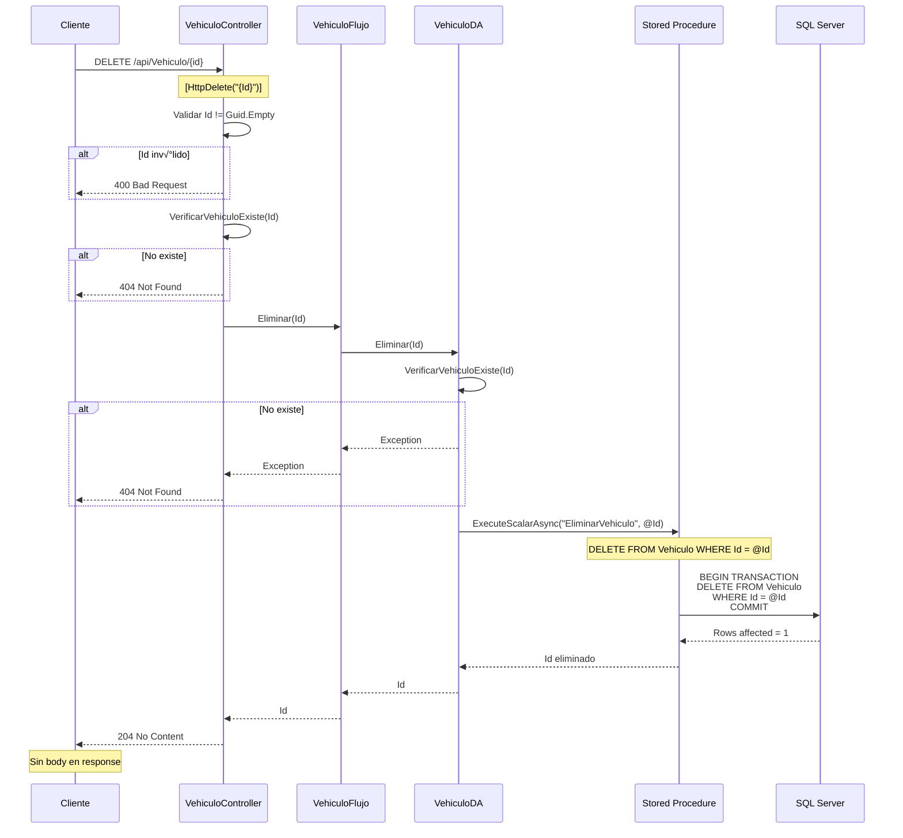

# API - DELETE: Eliminar Vehículo

## 📘 Operación de Eliminación (Delete)

Este documento explica la implementación del endpoint para **eliminar un vehículo** de la base de datos.

---

## 🎯 Objetivo

Eliminar permanentemente un vehículo del sistema.

**Endpoint**: `DELETE /api/Vehiculo/{id}`

**Response**: `204 No Content` (sin body)

---

## 🔄 Flujo Completo de Eliminación


```mermaid
sequenceDiagram
    participant Client as Cliente
    participant API as VehiculoController
    participant Flujo as VehiculoFlujo
    participant DA as VehiculoDA
    participant SP as Stored Procedure
    participant DB as SQL Server
    
    Client->>API: DELETE /api/Vehiculo/{id}
    Note over API: [HttpDelete("{Id}")]
    
    API->>API: Validar Id != Guid.Empty
    
    alt Id inv√°lido
        API-->>Client: 400 Bad Request
    end
    
    API->>API: VerificarVehiculoExiste(Id)
    
    alt No existe
        API-->>Client: 404 Not Found
    end
    
    API->>Flujo: Eliminar(Id)
    
    Flujo->>DA: Eliminar(Id)
    
    DA->>DA: VerificarVehiculoExiste(Id)
    
    alt No existe
        DA-->>Flujo: Exception
        Flujo-->>API: Exception
        API-->>Client: 404 Not Found
    end
    
    DA->>SP: ExecuteScalarAsync("EliminarVehiculo", @Id)
    Note over SP: DELETE FROM Vehiculo WHERE Id = @Id
    
    SP->>DB: BEGIN TRANSACTION<br/>DELETE FROM Vehiculo<br/>WHERE Id = @Id<br/>COMMIT
    DB-->>SP: Rows affected = 1
    SP-->>DA: Id eliminado
    
    DA-->>Flujo: Id
    Flujo-->>API: Id
    
    API-->>Client: 204 No Content
    Note over Client: Sin body en response
```

---

## 💻 Implementación Backend

### 1. Controller

```csharp
// API/Controllers/VehiculoController.cs

/// <summary>
/// Elimina un vehículo del sistema.
/// </summary>
/// <param name="Id">GUID del vehículo a eliminar</param>
/// <returns>204 No Content si fue exitoso</returns>
/// <response code="204">Vehículo eliminado exitosamente</response>
/// <response code="404">El vehículo no existe</response>
/// <response code="400">ID inv√°lido</response>
[HttpDelete("{Id}")]
[ProducesResponseType(StatusCodes.Status204NoContent)]
[ProducesResponseType(StatusCodes.Status404NotFound)]
[ProducesResponseType(StatusCodes.Status400BadRequest)]
public async Task<IActionResult> Eliminar([FromRoute] Guid Id)
{
    try
    {
        // 1. Validar que el ID no sea vacío
        if (Id == Guid.Empty)
        {
            _logger.LogWarning("ID de vehículo inválido para eliminación");
            return BadRequest(new { mensaje = "ID de vehículo inválido" });
        }
        
        _logger.LogInformation($"Eliminando vehículo {Id}");
        
        // 2. ⭐ Verificar que el vehículo existe
        if (!await VerificarVehiculoExiste(Id))
        {
            _logger.LogWarning($"Vehículo {Id} no encontrado para eliminar");
            return NotFound(new { mensaje = "El vehículo no existe" });
        }
        
        // 3. Eliminar
        var resultado = await _vehiculoFlujo.Eliminar(Id);
        
        _logger.LogInformation($"Vehículo {Id} eliminado exitosamente");
        
        // 4. ⭐ Retornar 204 No Content (sin body)
        return NoContent();
    }
    catch (Exception ex)
    {
        _logger.LogError(ex, $"Error al eliminar vehículo {Id}");
        return StatusCode(500, new { mensaje = "Error interno del servidor" });
    }
}

/// <summary>
/// Helper para verificar si un vehículo existe.
/// </summary>
private async Task<bool> VerificarVehiculoExiste(Guid Id)
{
    var resultado = await _vehiculoFlujo.Obtener(Id);
    return resultado != null;
}
```

**Características clave**:
- ✅ `[HttpDelete("{Id}")]`: Método HTTP DELETE
- ✅ Verificación de existencia previa
- ‚úÖ `NoContent()`: 204 sin body (REST best practice)
- ✅ Logging de operación crítica

---

### 2. Flujo (Business Logic)

```csharp
// Flujo/VehiculoFlujo.cs

public async Task<Guid> Eliminar(Guid Id)
{
    // Validaciones de negocio adicionales
    // Por ejemplo: no permitir eliminar vehículos con pagos pendientes
    
    // Verificar si el vehículo tiene dependencias
    // (en este caso simple, no hay restricciones)
    
    return await _vehiculoDA.Eliminar(Id);
}
```

**Extensión futura**:
```csharp
public async Task<Guid> Eliminar(Guid Id)
{
    // Verificar dependencias antes de eliminar
    var tienePagos = await _pagoDA.TienePagosPendientes(Id);
    if (tienePagos)
    {
        throw new Exception("No se puede eliminar. El vehículo tiene pagos pendientes.");
    }
    
    return await _vehiculoDA.Eliminar(Id);
}
```

---

### 3. Data Access

```csharp
// DA/VehiculoDA.cs

public async Task<Guid> Eliminar(Guid Id)
{
    // 1. Verificar que el vehículo existe
    await VerificarVehiculoExiste(Id);
    
    string query = @"EliminarVehiculo"; // Stored Procedure
    
    try
    {
        // 2. Ejecutar SP con Dapper
        var resultado = await _sqlConnection.ExecuteScalarAsync<Guid>(
            query,
            new { Id = Id },
            commandType: CommandType.StoredProcedure
        );
        
        return resultado;
    }
    catch (SqlException ex)
    {
        throw new Exception($"Error al eliminar vehículo: {ex.Message}", ex);
    }
}

/// <summary>
/// Verifica que un vehículo existe, lanza excepción si no.
/// </summary>
private async Task VerificarVehiculoExiste(Guid Id)
{
    var vehiculo = await Obtener(Id);
    if (vehiculo == null)
    {
        throw new Exception("No se encontró el vehículo");
    }
}
```

---

### 4. Stored Procedure

```sql
-- BD/dbo/Stored Procedures/EliminarVehiculo.sql
CREATE PROCEDURE [dbo].[EliminarVehiculo]
    @Id UNIQUEIDENTIFIER
AS
BEGIN
    SET NOCOUNT ON;
    
    BEGIN TRANSACTION;
    
    BEGIN TRY
        -- Verificar que el vehículo existe
        IF NOT EXISTS (SELECT 1 FROM Vehiculo WHERE Id = @Id)
        BEGIN
            THROW 50001, 'El vehículo no existe', 1;
        END
        
        -- Verificar que no tiene referencias (si aplica)
        -- Por ejemplo, si hubiera tabla de Mantenimientos:
        -- IF EXISTS (SELECT 1 FROM Mantenimiento WHERE IdVehiculo = @Id)
        -- BEGIN
        --     THROW 50002, 'No se puede eliminar. Tiene mantenimientos asociados.', 1;
        -- END
        
        -- Eliminar vehículo
        DELETE FROM Vehiculo
        WHERE Id = @Id;
        
        -- Verificar que se eliminó
        IF @@ROWCOUNT = 0
        BEGIN
            THROW 50003, 'No se pudo eliminar el vehículo', 1;
        END
        
        COMMIT TRANSACTION;
        
        -- Retornar el ID eliminado
        SELECT @Id;
        
    END TRY
    BEGIN CATCH
        ROLLBACK TRANSACTION;
        THROW;
    END CATCH
END
```

**Consideraciones**:
- ✅ Transacción para atomicidad
- ✅ Verificación de existencia
- ✅ Verificación de dependencias (comentado)
- ‚úÖ Validar `@@ROWCOUNT` (filas afectadas)

---

## üîê HTTP Request/Response

### Request Example

```http
DELETE /api/Vehiculo/3fa85f64-5717-4562-b3fc-2c963f66afa6 HTTP/1.1
Host: localhost:7001
```

### Success Response (204 No Content)

```http
HTTP/1.1 204 No Content
Content-Length: 0
```

**Importante**: ⭐ **No hay body en la respuesta**. Esto es correcto según REST.

### Not Found (404)

```http
HTTP/1.1 404 Not Found
Content-Type: application/json

{
  "mensaje": "El vehículo no existe"
}
```

### Bad Request (400)

```http
HTTP/1.1 400 Bad Request
Content-Type: application/json

{
  "mensaje": "ID de vehículo inválido"
}
```

---

## 🎯 Soft Delete vs Hard Delete

### Hard Delete (Implementación Actual)

```sql
-- Elimina permanentemente el registro
DELETE FROM Vehiculo WHERE Id = @Id;
```

**Pros**:
- ‚úÖ Simple
- ‚úÖ Libera espacio
- ‚úÖ Cumple GDPR (derecho al olvido)

**Contras**:
- ‚ùå No se puede recuperar
- ‚ùå Se pierde historial
- ❌ Problemas con auditoría

### Soft Delete (Alternativa)

```sql
-- Solo marca como eliminado
ALTER TABLE Vehiculo ADD EliminadoEn DATETIME NULL;
ALTER TABLE Vehiculo ADD Eliminado BIT DEFAULT 0;

-- En el SP:
UPDATE Vehiculo
SET 
    Eliminado = 1,
    EliminadoEn = GETDATE()
WHERE 
    Id = @Id;
```

**Modificar queries**:
```sql
-- Ahora todos los SELECT deben filtrar
SELECT * FROM Vehiculo WHERE Eliminado = 0;
```

**Pros**:
- ‚úÖ Recuperable
- ‚úÖ Mantiene historial
- ✅ Auditoría completa

**Contras**:
- ‚ùå M√°s complejo
- ❌ Requiere limpiar periódicamente
- ‚ùå Aumenta consumo de espacio

---

## ⚠️ Consideraciones de Seguridad

### 1. Confirmación en Cliente

```javascript
// React/Razor Pages debe pedir confirmación
const confirmar = confirm("¿Está seguro de eliminar este vehículo?");
if (confirmar) {
    await api.delete(`/api/Vehiculo/${id}`);
}
```

### 2. Autorización

```csharp
// Agregar atributo de autorización
[Authorize(Roles = "Admin")]
[HttpDelete("{Id}")]
public async Task<IActionResult> Eliminar([FromRoute] Guid Id)
{
    // Solo usuarios Admin pueden eliminar
}
```

### 3. Rate Limiting

```csharp
// Limitar n√∫mero de eliminaciones por minuto
[RateLimit(PermitLimit = 10, Window = 60)] // 10 por minuto
[HttpDelete("{Id}")]
public async Task<IActionResult> Eliminar([FromRoute] Guid Id)
{
    // ...
}
```

---

## üß™ Testing

```csharp
[Fact]
public async Task Eliminar_VehiculoExiste_Retorna204NoContent()
{
    // Arrange
    var id = Guid.NewGuid();
    var vehiculoExistente = new VehiculoDetalle { Id = id };
    
    _mockFlujo.Setup(f => f.Obtener(id)).ReturnsAsync(vehiculoExistente);
    _mockFlujo.Setup(f => f.Eliminar(id)).ReturnsAsync(id);

    // Act
    var result = await _controller.Eliminar(id);

    // Assert
    var noContentResult = Assert.IsType<NoContentResult>(result);
    Assert.Equal(204, noContentResult.StatusCode);
}

[Fact]
public async Task Eliminar_VehiculoNoExiste_Retorna404()
{
    // Arrange
    var id = Guid.NewGuid();
    _mockFlujo.Setup(f => f.Obtener(id)).ReturnsAsync((VehiculoDetalle)null);

    // Act
    var result = await _controller.Eliminar(id);

    // Assert
    Assert.IsType<NotFoundObjectResult>(result);
}

[Fact]
public async Task Eliminar_IdVacio_Retorna400()
{
    // Arrange & Act
    var result = await _controller.Eliminar(Guid.Empty);

    // Assert
    Assert.IsType<BadRequestObjectResult>(result);
}
```

---

## üìä Resumen de Operaciones CRUD

| Operación | Método | Endpoint | Request Body | Response | Status |
|-----------|--------|----------|--------------|----------|--------|
| **Create** | POST | `/api/Vehiculo` | `VehiculoRequest` | Location header | 201 |
| **Read All** | GET | `/api/Vehiculo` | - | `VehiculoResponse[]` | 200/204 |
| **Read One** | GET | `/api/Vehiculo/{id}` | - | `VehiculoDetalle` | 200/404 |
| **Update** | PUT | `/api/Vehiculo/{id}` | `VehiculoRequest` | `{id}` | 200/404 |
| **Delete** | DELETE | `/api/Vehiculo/{id}` | - | (vacío) | 204/404 |

---

## üí° Best Practices

### 1. Siempre Verificar Existencia

```csharp
// ‚úÖ Correcto
if (!await VerificarVehiculoExiste(Id))
    return NotFound();

await _flujo.Eliminar(Id);
```

### 2. Usar 204 No Content

```csharp
// ‚úÖ Correcto (REST standard)
return NoContent();

// ‚ùå Incorrecto
return Ok(new { mensaje = "Eliminado" }); // No usar body
```

### 3. Logging de Operaciones Críticas

```csharp
_logger.LogWarning($"Usuario {userId} eliminó vehículo {Id}");
```

### 4. Considerar Soft Delete para Auditoría

```csharp
if (_configuration.GetValue<bool>("UseSoftDelete"))
{
    await _flujo.MarcarComoEliminado(Id);
}
else
{
    await _flujo.Eliminar(Id);
}
```

---

## üìö Documentos Relacionados

- **[API - Arquitectura General](./vehiculo-api-arquitectura.md)** - Visión completa del sistema
- **[API - GET Listar](./01-api-get-listar-vehiculos.md)** - Ver todos los vehículos
- **[API - POST Crear](./03-api-post-crear-vehiculo.md)** - Crear nuevo vehículo

---

**Completado**: Documentación de todas las operaciones CRUD del API ✅
